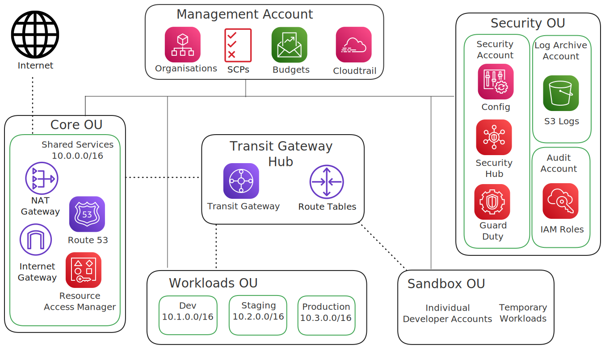

# AWS Enterprise Landing Zone

[](https://github.com/Simodalstix/AWS-enterprise-landingzone/actions/workflows/ci.yml)
[](https://opensource.org/licenses/MIT)
[](https://github.com/Simodalstix/AWS-enterprise-landingzone/releases)
[](https://www.python.org/downloads/)
[](https://docs.aws.amazon.com/cdk/)

Production-ready AWS Landing Zone using CDK with enterprise organizational structure, governance, and security baseline.

## Why This Matters

Setting up AWS at enterprise scale requires careful planning of account structure, security baselines, and governance. This landing zone provides a battle-tested foundation that:

- **Reduces setup time** from months to days
- **Enforces security best practices** from day one
- **Scales with your organization** as you grow
- **Maintains compliance** with automated governance

## Architecture



*Architecture diagram created using AWS official icons and Excalidraw*

### Organizational Structure

- **Core Accounts**: Security, Log Archive, Audit, Shared Services
- **Workload Accounts**: Dev, Staging, Production
- **OUs**: Security OU, Workloads OU, Sandbox OU

### Security Baseline

- GuardDuty threat detection
- Security Hub centralized findings
- Config rules for compliance
- KMS centralized key management
- Cross-account IAM roles

### Networking Foundation

- Transit Gateway hub-and-spoke model
- Standardized VPC templates
- Network segmentation and security groups

### Governance & Compliance

- Service Control Policies (SCPs)
- Organization-wide CloudTrail
- Budget controls and monitoring
- Automated compliance checking

## Quick Start

**Prerequisites:** AWS CLI configured, Node.js 20+, Python 3.9+

```bash
# Install dependencies
pip install -r requirements.txt
npm install -g aws-cdk

# Configure your settings
# Edit src/config/landing_zone_config.py

# Bootstrap CDK (one-time setup)
cdk bootstrap

# Deploy landing zone
cdk deploy --all
```

## Project Structure

```
src/
├── constructs/
│   ├── account/          # Account factory, baseline setup
│   ├── governance/       # SCPs, Config rules, compliance
│   ├── security/         # GuardDuty, Security Hub, IAM
│   ├── networking/       # Transit Gateway, VPC patterns
│   └── monitoring/       # Cross-account observability
├── stacks/
│   ├── core_stack.py     # Organization setup, root account
│   ├── security_stack.py # Security services and baselines
│   ├── network_stack.py  # Networking foundation
│   └── workload_stack.py # Account provisioning
├── config/
│   └── landing_zone_config.py  # Environment configurations
└── utils/
    └── account_utils.py  # Account management utilities
```

## Key Features

- **Single Responsibility**: Each construct handles one specific concern
- **Modularity**: Reusable constructs for common patterns
- **Security First**: Multi-layered security with centralized management
- **Compliance Ready**: Automated governance and monitoring
- **Scalable**: Hub-and-spoke networking with proper segmentation

## Configuration

Customize your deployment by editing `src/config/landing_zone_config.py`:

- **Account emails** - Update with your organization's email addresses
- **Network CIDRs** - Adjust IP ranges for your network design
- **Security settings** - Configure compliance and monitoring preferences
- **Organizational units** - Define your account structure

## Deployment

Stacks deploy in dependency order automatically. Manual order if needed:

1. **Core Stack** - Organization and accounts
2. **Security Stack** - Security baseline
3. **Network Stack** - Transit Gateway and shared VPC
4. **Workload Stack** - Environment VPCs

## Contributing

See [CONTRIBUTING.md](CONTRIBUTING.md) for development setup and guidelines.

## License

MIT License - see [LICENSE](LICENSE) file for details.
